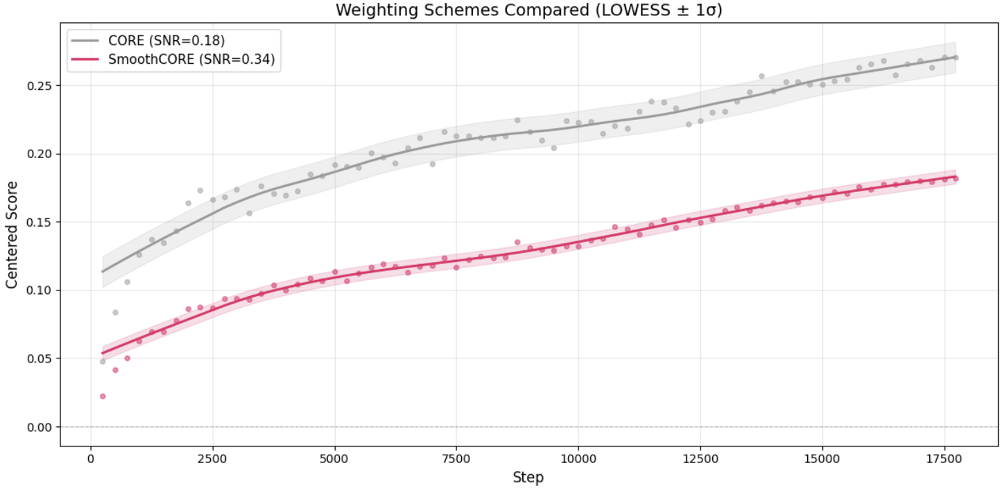
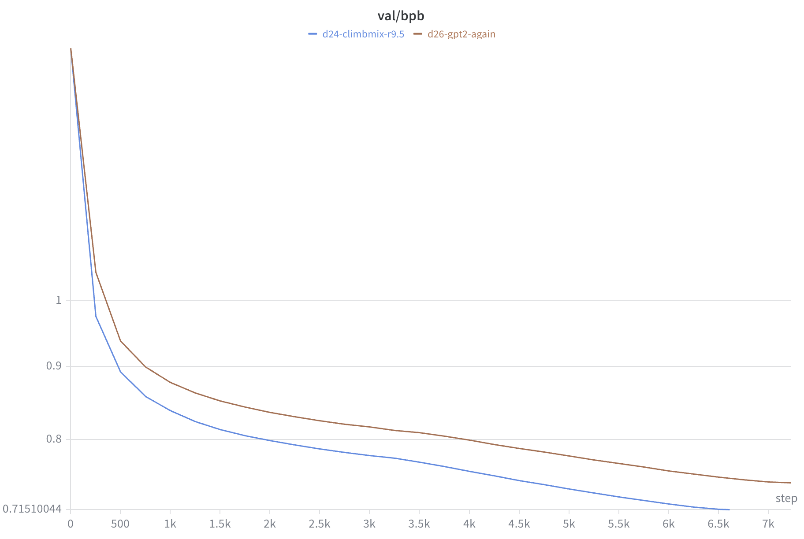

# Reference: how to read nanochat's metrics

Karpathy's own notes on CORE and validation loss, from the nanochat Discord. Kept
here because they set the error bars for our own numbers: at d24 scale a CORE
difference under ~0.015 is noise, and val bpb is the metric with enough
resolution to compare runs.

Quoted verbatim; the **Relevance** lines are ours. Discord CDN image links expire,
so the plots are mirrored next to this file.

---

## Run-to-run spread of CORE — 5 runs (2026-03-01)

[message](https://discordapp.com/channels/1020383067459821711/1427295580895314031/1477721955615510528)

> **Sofie:** Just out of curiosity, what exactly was the CORE range for the 5 runs?
>
> **Karpathy:**
> ```
> 0.26468
> 0.2649
> 0.2514
> 0.2592
> 0.26668
> ```
> mean 0.261
> max-min: 0.01528

**Relevance.** This is the error bar to quote against our own CORE. Identical
configs re-run five times span 0.0153. Any CORE comparison between two runs that
differ by less than that is measuring the seed, not the change.

---

## Run-to-run spread again — 7 runs, and why val loss became the metric (2026-03-04)

[message](https://discordapp.com/channels/1020383067459821711/1427295580895314031/1478780521956769862)

TODO - Are these numbers a copy-paste error? Unlikely--could be a different
model scale, or some kind of change in the metric.
TODO - Where is the 40M eval tokens flag the agent referenced? Is it only
in Karpathy's LEADERBOARD.md run reference?

> I'm looking at the validation loss as the "metric". But I also lifted the number
> of tokens it's almost 40M tokens now, that seems like a lot
>
> the run-to-run variance on val loss is very low, i did 7 runs and they are all on
> top of each other
>
> 7 runs:
> ```
> 0.25373
> 0.2584
> 0.25489
> 0.2568
> 0.25732
> 0.26765
> 0.25119
> ```
> avg: 0.25714
> max-min: 0.01646

**Relevance.** The takeaway is the *contrast*: val loss over ~40M eval tokens is stable enough to
rank runs, CORE is not. That is why our own reporting leads with val bpb.

Note on the numbers: they are almost certainly **CORE**, not val loss — d24 val bpb
is ~0.72 (see the ClimbMix plot below), nowhere near 0.257, and the spread (0.0165)
matches the 5-run CORE spread (0.0153) closely. Read as a second CORE sample it is
consistent; read as val loss it would contradict "all on top of each other". Not
worth citing as val-loss variance without confirming.

40M eval tokens is nanochat's `--eval-tokens 41943040`. Our runs use 10,485,760
(`cfg.val_tokens`), 4x fewer, so our val bpb is correspondingly noisier than his.

---

## SmoothCORE: why CORE is noisy at this scale (2026-02-03)

> Ok after a bunch of work I think I'm converging on something a lot smoother than
> CORE. Comparison of current CORE and the new SmoothCORE. Basically:
>
> **Filter.** close manual inspection reveals there are only 12/22 metrics in the
> CORE score that are low noise and monotonically increasing - i.e. providing signal
> at our (smallish) scale.
>
> **Soft pass.** current CORE has individual examples HARD pass/fail. If you get the
> correct MC answer you get 1 otherwise 0. Soft pass will give partial credit, e.g.
> 0.8 instead, depending on the actual probability
>
> **SNR weighting.** Some metrics still contribute more noise then signal. I plot the
> 12 individually and calculate SNR and use that to calculate the actual weights for
> the mix. So for example, Hellaswag has really strong SNR so it gets higher weight
> (0.1266 vs. uniform 0.077). Basically the mix itself is an SNR-weighted average,
> not just average straight up.
>
> So we filter, soft pass, and SNR weight to get the SmoothCORE. If we go in this
> direction it's something like that



**Relevance.** The mechanism behind the spread above: 10 of CORE's 22 tasks carry
no usable signal at d24 scale, and hard pass/fail throws away the probability mass
that would smooth the rest. SNR 0.18 → 0.34 just by re-weighting. Our CORE
printout is the unmodified 22-task version, so it inherits all of this — treat it
as a sanity check that the model learned something, not as a ranking metric.

---

## Bonus: ClimbMix is less "perplexing" than FineWeb-Edu (2026-02-28)

[message](https://discordapp.com/channels/1020383067459821711/1427295580895314031/1477392261406003260)

> the other interesting thing to point out is that the validation loss curves for
> ClimbMix are lower - in absolute value
>
> Basically ClimbMix is less "perplexing" data on average



**Relevance.** Absolute bpb is a property of the *dataset*, not only the model, so
bpb numbers are only comparable within a fixed corpus + tokenizer. We train on
ClimbMix, which is the same corpus as the blue curve — so his ~0.715 is the right
order of magnitude to expect, and a bpb quoted against a FineWeb-Edu run is not a
comparison at all.

The curve is also a useful landmark on its own: `d24-climbmix-r9.5` bottoms out
around **0.7151** at ~6.5k steps. That run is at data:param ratio 9.5 where ours is
8, so it sees more tokens — and it is measured through the batched (non-varlen)
pipeline, which is a different measurement, not just a different number. See the
caveat in the repo README.
